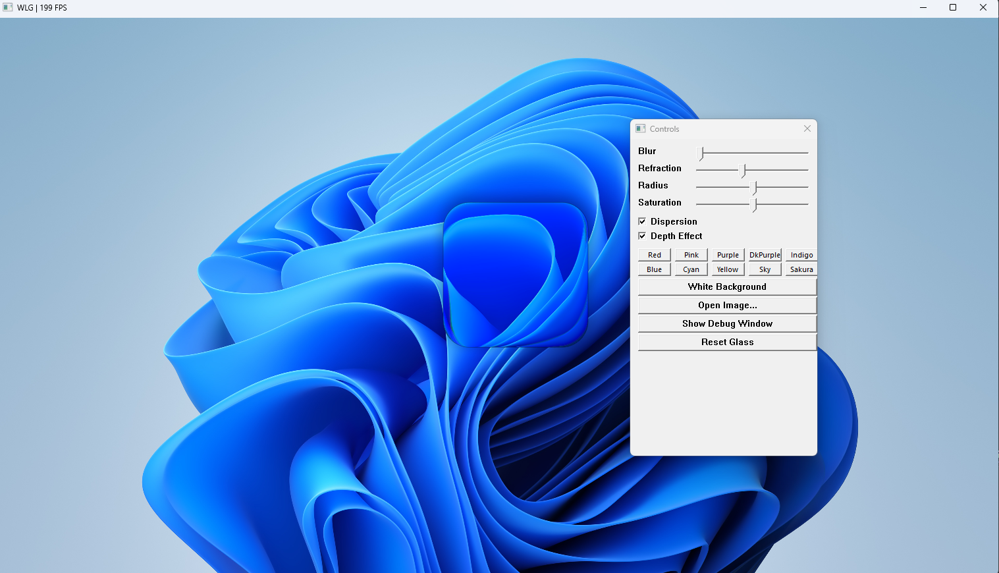

[English](#english) | [中文](#中文)

---

<a id="english"></a>
# WindowsLiquidGlass

Real-time frosted glass rendering library for Windows desktop applications. Pure D3D11 + HLSL, zero external dependencies.



## Supported Platforms

| Platform | Status |
|----------|--------|
| Windows 11 | ✅ Full support |
| Windows 10 | ✅ Full support |
| Windows 8/8.1 | ⚠️ Untested (should work) |
| Windows 7 | ❌ Requires D3D11.1+ |

GPU with Direct3D 11 support required.

## How It Works

WindowsLiquidGlass renders a frosted glass overlay by compositing multiple rendering passes:

1. **Background Capture** — fills the backbuffer with a solid color or image
2. **Gaussian Blur** — 15-tap separable blur (horizontal + vertical) on the background
3. **Drop Shadow** — SDF-based soft shadow with smoothstep for depth
4. **Glass Body** — SDF rounded-rect refraction with saturation boost and optional chromatic dispersion
5. **Composite** — alpha-blends the glass onto the backbuffer

All rendering uses a single fullscreen triangle, constant buffers for parameters, and SDF (Signed Distance Field) math for sharp, anti-aliased rounded corners.

## Usage

### 1. Copy library files into your project

```
YourProject/
├── LiquidGlass.h
├── LiquidGlass.cpp
├── LiquidGlassShaders.h
└── main.cpp
```

### 2. Add to vcxproj

```xml
<ItemGroup>
  <ClCompile Include="LiquidGlass.cpp" />
</ItemGroup>
<ItemGroup>
  <ClInclude Include="LiquidGlass.h" />
  <ClInclude Include="LiquidGlassShaders.h" />
</ItemGroup>
```

Linker: `d3d11.lib; d3dcompiler.lib; dxgi.lib; dxguid.lib; ole32.lib;`

### 3. Code

```cpp
#include "LiquidGlass.h"

LiquidGlass::Renderer glass;

// Init
glass.Init(hwnd, width, height);
glass.Blur(12).Radius(40).Saturation(1.5f).RefractionAmount(50).RefractionHeight(30);
glass.SetBackgroundColor(1, 1, 1);

// Per frame — just 3 lines
glass.BeginFrame();
glass.RenderGlass(x, y, width, height);
glass.EndFrame();
```

## API

### Lifecycle

| Method | Description |
|--------|-------------|
| `Init(hwnd, w, h)` | Create D3D11 device, swap chain, shaders |
| `Resize(w, h)` | Handle WM_SIZE |
| `BeginFrame()` | Clear backbuffer, apply background |
| `EndFrame()` | Present swap chain |

### Background

| Method | Description |
|--------|-------------|
| `SetBackgroundColor(r, g, b)` | Solid color background |
| `LoadBackgroundImage(path)` | JPEG/PNG/BMP via WIC. Returns `bool` |
| `ClearBackground()` | Remove image |

### Glass Parameters (fluent, chainable)

| Method | Range | Default | Description |
|--------|-------|---------|-------------|
| `Blur(sigma)` | 0.1 ~ 30 | 12 | Gaussian blur amount |
| `Saturation(s)` | 1.0 ~ 2.0 | 1.5 | Color vibrancy |
| `RefractionAmount(a)` | 4 ~ 120 | 50 | Refraction strength |
| `RefractionHeight(h)` | 4 ~ 60 | 30 | Lens thickness (px) |
| `Radius(r)` | 0 ~ 80 | 40 | Corner roundness |
| `Dispersion(intensity)` | 0.0 ~ 1.0 | 1.0 | Chromatic aberration |
| `Depth(on)` | bool | true | Depth-based refraction |
| `Config(cfg)` | GlassConfig | — | Set all params at once |

### Render

| Method | Description |
|--------|-------------|
| `RenderGlass(x, y, w, h)` | Draw glass using params set via the fluent methods above |
| `RenderGlass(x, y, w, h, cfg)` | Draw glass with a specific `GlassConfig` |

### D3D11 Access

| Method | Description |
|--------|-------------|
| `GetDevice()` | `ID3D11Device*` |
| `GetContext()` | `ID3D11DeviceContext*` |
| `Width()` / `Height()` | Current render size |
| `DumpDebugMessages()` | Print D3D11 debug layer diagnostics |

## Notes

- Call `Init()` **after** the window is created and visible
- Call `Resize()` on `WM_SIZE` — it handles swap chain recreation
- The background image is scaled to **cover** the window (aspect-ratio fill with cropping)
- On solid-color backgrounds, the glass body is slightly darkened (85%) to remain visible
- Enable the D3D11 debug layer in Debug builds for validation messages
- The library uses `#pragma comment(lib, ...)` for linker dependencies — no manual linker config needed

> ⚠️ **This library is in experimental/alpha stage. APIs may change in future versions!**

## License

[Apache-2.0](https://www.apache.org/licenses/LICENSE-2.0)

---

<a id="中文"></a>
# WindowsLiquidGlass

Windows 桌面应用的实时毛玻璃渲染库。纯 D3D11 + HLSL，零外部依赖。


## 支持平台

| 平台 | 状态 |
|------|------|
| Windows 11 | ✅ 完整支持 |
| Windows 10 | ✅ 完整支持 |
| Windows 8/8.1 | ⚠️ 未测试（理论上可用） |
| Windows 7 | ❌ 需要 D3D11.1+ |

需 GPU 支持 Direct3D 11。

## 实现原理

通过多层渲染通道合成毛玻璃叠加效果：

1. **背景捕获** — 将纯色或图片填充到 backbuffer
2. **高斯模糊** — 对背景进行 15-tap 可分离模糊（水平+垂直）
3. **投影** — 基于 SDF 的柔化阴影，使用 smoothstep 产生深度感
4. **玻璃主体** — SDF 圆角矩形的折射效果，配合饱和度增强和可选色散
5. **合成** — alpha 混合将玻璃叠加到 backbuffer

所有渲染使用单个全屏三角形，参数通过常量缓冲区传递，圆角使用 SDF（有符号距离场）数学实现无锯齿边缘。

## 使用方法

### 1. 将库文件复制到项目中

```
YourProject/
├── LiquidGlass.h
├── LiquidGlass.cpp
├── LiquidGlassShaders.h
└── main.cpp
```

### 2. 在 vcxproj 中添加

```xml
<ItemGroup>
  <ClCompile Include="LiquidGlass.cpp" />
</ItemGroup>
<ItemGroup>
  <ClInclude Include="LiquidGlass.h" />
  <ClInclude Include="LiquidGlassShaders.h" />
</ItemGroup>
```

链接器依赖：`d3d11.lib; d3dcompiler.lib; dxgi.lib; dxguid.lib; ole32.lib;`

### 3. 写代码

```cpp
#include "LiquidGlass.h"

LiquidGlass::Renderer glass;

// 初始化
glass.Init(hwnd, width, height);
glass.Blur(12).Radius(40).Saturation(1.5f).RefractionAmount(50).RefractionHeight(30);
glass.SetBackgroundColor(1, 1, 1);

// 每帧 —— 只需 3 行
glass.BeginFrame();
glass.RenderGlass(x, y, width, height);
glass.EndFrame();
```

## API

### 生命周期

| 方法 | 说明 |
|------|------|
| `Init(hwnd, w, h)` | 创建 D3D11 设备、交换链、着色器 |
| `Resize(w, h)` | 处理 WM_SIZE |
| `BeginFrame()` | 清空 backbuffer，应用背景 |
| `EndFrame()` | 呈现交换链 |

### 背景

| 方法 | 说明 |
|------|------|
| `SetBackgroundColor(r, g, b)` | 纯色背景 |
| `LoadBackgroundImage(path)` | 通过 WIC 加载 JPEG/PNG/BMP，返回 `bool` |
| `ClearBackground()` | 移除背景图片 |

### 玻璃参数（链式调用）

| 方法 | 范围 | 默认值 | 说明 |
|------|------|--------|------|
| `Blur(sigma)` | 0.1 ~ 30 | 12 | 高斯模糊量 |
| `Saturation(s)` | 1.0 ~ 2.0 | 1.5 | 色彩饱和度 |
| `RefractionAmount(a)` | 4 ~ 120 | 50 | 折射扭曲强度 |
| `RefractionHeight(h)` | 4 ~ 60 | 30 | 折射厚度（像素） |
| `Radius(r)` | 0 ~ 80 | 40 | 圆角半径 |
| `Dispersion(intensity)` | 0.0 ~ 1.0 | 1.0 | 色散强度 |
| `Depth(on)` | bool | true | 深度折射渐变 |
| `Config(cfg)` | GlassConfig | — | 一次性设置全部参数 |

### 渲染

| 方法 | 说明 |
|------|------|
| `RenderGlass(x, y, w, h)` | 使用链式方法设置的参数绘制玻璃 |
| `RenderGlass(x, y, w, h, cfg)` | 使用指定的 `GlassConfig` 绘制玻璃 |

### D3D11 访问

| 方法 | 说明 |
|------|------|
| `GetDevice()` | `ID3D11Device*` |
| `GetContext()` | `ID3D11DeviceContext*` |
| `Width()` / `Height()` | 当前渲染尺寸 |
| `DumpDebugMessages()` | 打印 D3D11 调试层诊断信息 |

## 注意事项

- `Init()` 必须在窗口创建并可见**之后**调用
- 在 `WM_SIZE` 中调用 `Resize()`——它会处理交换链重建
- 背景图片按 **cover** 模式缩放（保持比例填充，超出部分裁剪）
- 纯色背景上玻璃体会略微变暗（85%）以保持可见
- Debug 构建自动启用 D3D11 调试层，用于验证渲染调用
- 库文件使用 `#pragma comment(lib, ...)` 自动链接依赖，无需手动配置

> ⚠️ **此库处于实验测试阶段，API 可能会在未来版本中变更！**

## 许可证

[Apache-2.0](https://www.apache.org/licenses/LICENSE-2.0)
